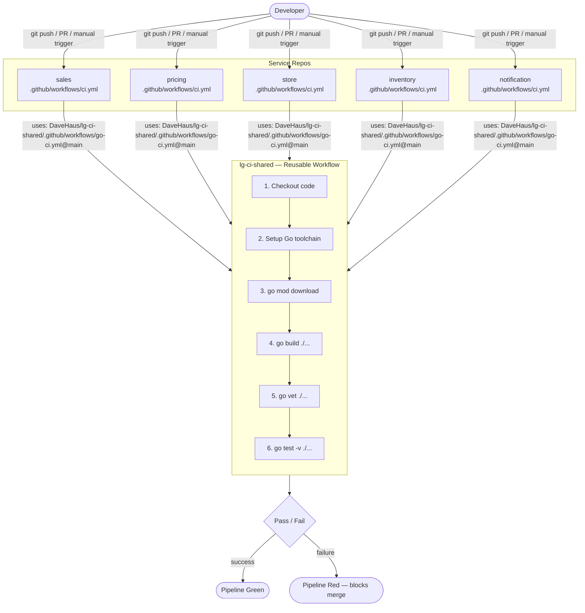

# LG Go Services — CI Architecture

Shared reusable GitHub Actions workflow for 5 Go microservices. Each service repo references this workflow rather than maintaining its own CI logic.

## Architecture



## Services

| Repo | Endpoint | Description |
|------|----------|-------------|
| [sales](https://github.com/DaveHaus/sales) | `POST /sales` | Record a sale |
| [pricing](https://github.com/DaveHaus/pricing) | `GET /price` | Current apple price |
| [store](https://github.com/DaveHaus/store) | `GET /stores` | Store and manager list |
| [inventory](https://github.com/DaveHaus/inventory) | `GET /inventory` | Stock levels per store |
| [notification](https://github.com/DaveHaus/notification) | `POST /notify` | Alert store managers |

## How It Works

Each service repo contains a minimal `ci.yml` that delegates entirely to this shared workflow:

```yaml
jobs:
  build-and-test:
    uses: DaveHaus/lg-ci-shared/.github/workflows/go-ci.yml@main
    with:
      service-name: sales
```

One change to `go-ci.yml` here propagates to all 5 services on their next run. No per-repo CI maintenance required.

## CI Stages

| Stage | Command | Purpose |
|-------|---------|---------|
| Dependencies | `go mod download` | Pull declared deps from go.mod |
| Build | `go build ./...` | Compile — proves code is valid Go |
| Vet | `go vet ./...` | Static analysis — catches common bugs |
| Test | `go test -v ./...` | Run unit tests with verbose output |

## Triggering a Pipeline

Pipelines run automatically on `push` to `main` and on pull requests. To trigger manually:

**GitHub UI:** Repo → Actions → CI → Run workflow → select branch → Run

**CLI:**
```bash
gh workflow run ci.yml --repo DaveHaus/sales
```
